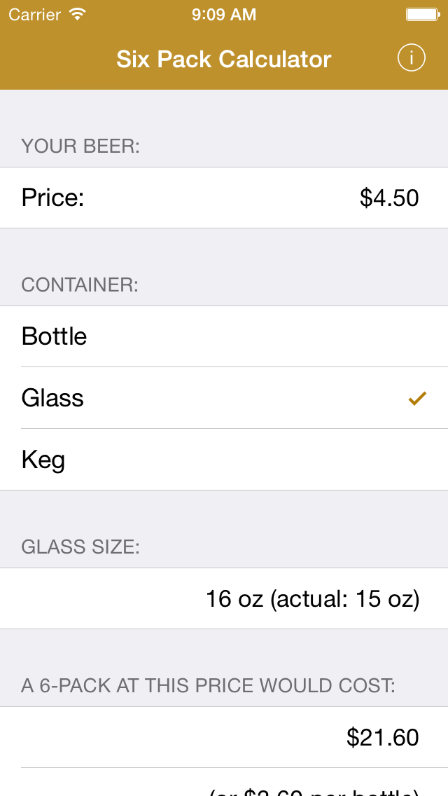
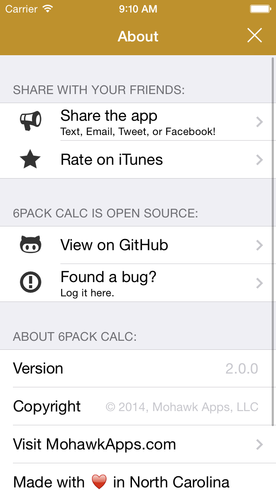

# 6Pack Calc 

#### A [RubyMotion](http://www.rubymotion.com/) application brought to you by [Off The Grid Apps](http://otgapps.io/).

Ever wonder how much you’re really paying for that pint of beer? Or how much that 64oz growler actually costs without having to do conversions in your head? 

With Six-Pack Equivalent Calculator, you put in the cost of your beer and the amount you got and the app will tell you the cost if you bought a six-pack of that particular beer. 

The idea is that everyone knows how much a six-pack of their favorite beer costs. This converter will help you determine the price of what you’re drinking right now to an equivalent you are already familiar with! 

I was happy to realize that a $9 fill of my 1/2 gallon growler (64oz) at my local brewpub was the equivalent of a $10.12 six-pack! That’s a great deal for craft beer when I’m used to paying upwards of $12 or more for good craft beer.

This app is open source. Browse the source code here: https://github.com/OTGApps/6PackCalc/

## Objective-C to RubyMotion

This app was converted from Objective-C to Rubymotion over the course of 2 days and aproximately 5-7 hours (everything, including new icon and app submission). If you want to see the legacy Objective-C code, check out the [SixPackCalc.objectivec.zip](SixPackCalc.objectivec.zip) file. But watch out, this code is extremely old and hasn't been tested in the current version of Xcode. I can't promise it'll work, but you can look through the source to see how much easier it is to do in RubyMotion!

## Download from the App Store

## How to run the app:

1. You must have a valid license of RubyMotion.
2. Run `bundle`
3. Run `rake pod:install`
4. Run `rake`
5. The simulator should launch automatically.

## Screenshots

  

## Contributing:

1. Fork it.
2. Work on a feature branch.
3. Send me a pull request.

*I also like it when people who can't contribute [open an issue](https://github.com/OTGApps/6PackCalc/issues)*
